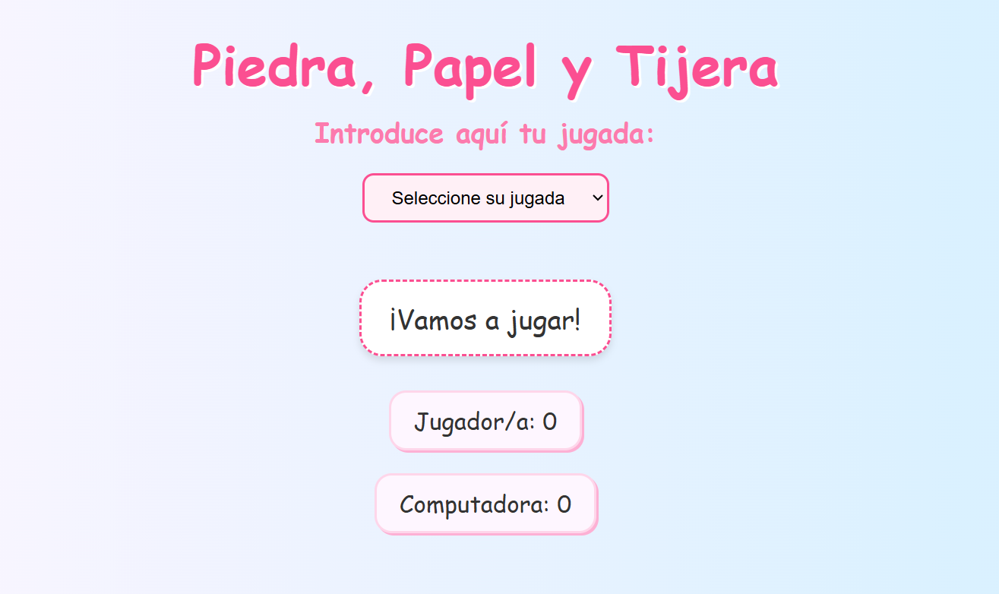

# Piedra, Papel o Tijera 🪨📄✂️

Este proyecto es un pequeño juego interactivo de **Piedra, Papel o Tijera**, desarrollado como ejercicio intermedio para practicar **JavaScript**, manipulación del DOM, eventos y lógica de programación.

---

## 🎯 Objetivo

Permitir al usuario jugar contra la computadora hasta 10 rondas, mostrando los resultados en pantalla y llevando el marcador en tiempo real. Al finalizar, se declara un ganador o un empate.

---

## 🛠️ Tecnologías utilizadas

- **HTML5** – estructura semántica del juego
- **CSS3** – estilos personalizados con diseño colorido y responsivo
- **JavaScript** – lógica del juego, control de eventos, interacción dinámica

---

## 📸 Vista previa



---

## 🚀 Funcionalidades

- Selección de jugada (piedra, papel o tijera)
- Jugadas aleatorias de la computadora
- Sistema de puntos para jugador/a y computadora
- Mensajes dinámicos con el resultado de cada ronda
- Fin de juego tras 10 jugadas, con botón de reinicio
- Diseño responsive y divertido

---

## 🧠 Conceptos aplicados

- `addEventListener` y eventos de formularios
- Condicionales y operadores lógicos
- Funciones puras (como `getComputerPlay`)
- Control del DOM con `querySelector` y `.innerHTML`
- Manipulación de clases (`classList.add/remove`)
- Uso de `select`, `option`, `form`, `button`

---

## 📝 ¿Cómo usarlo?

Clona este repositorio:

```bash
git clone https://github.com/Nelicah/juego-piedra-papel-tijeras.git
```

---

## 👩‍💻 Autora

**Cande Zamora**  
💼 Desarrolladora Full Stack  
🔗 [LinkedIn](https://www.linkedin.com/in/cande-zamora-125301349)  
🎨 Alias creativa: **Nelicah**
